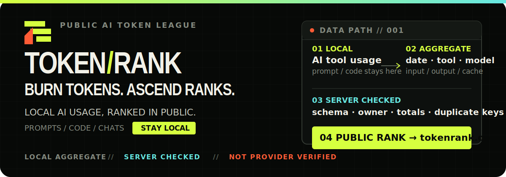
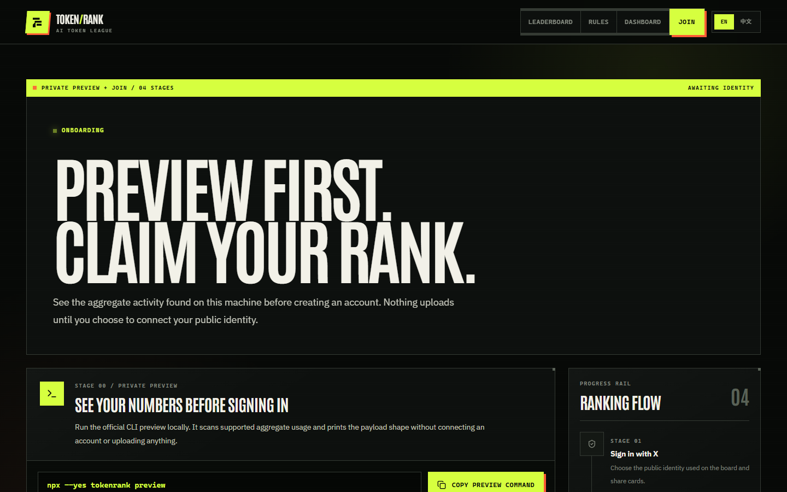

<p align="right">
  <a href="./README.md">English</a> · <strong>简体中文</strong>
</p>

<p align="center">
  
</p>

<p align="center">
  <a href="https://tokenrank.org"><strong>实时榜单</strong></a> ·
  <a href="https://tokenrank.org/onboard">加入榜单</a> ·
  <a href="https://tokenrank.org/rules">计分与隐私规则</a> ·
  <a href="https://github.com/tokenrank/tokenrank-cli">Collector CLI</a>
</p>

TokenRank 是公开的 AI Token 使用排行榜。它用公开 X 身份展示 Coding Agent 与 AI 工具的聚合 Token 活动，让用户按时间窗口和工具比较排名。

> **数据可信度：Local aggregate / server checked。** TokenRank 会校验上传结构、账号归属、Token 总量和重复键，但不会与 Provider 账单核对。榜单是活动信号，不是能力、生产力或工作质量评分；金额是估算值，不是账单。

## 先看真实产品

<p align="center">
  <a href="https://tokenrank.org/onboard">
    
  </a>
</p>

线上产品提供：

- Overall、Spend 与各 AI 工具分榜；
- Today UTC、3D、7D、30D、Month 时间窗口；
- 公开个人战绩、排名上下文、趋势、热力图、工具与模型分布；
- 可公开审阅的计分、隐私、可信度和异常数据处理规则。

## 三步加入榜单

### 1. 在本机预览

无需登录，也不会上传数据：

```bash
npx --yes tokenrank preview
```

### 2. 连接公开身份

打开 [tokenrank.org/onboard](https://tokenrank.org/onboard)，使用 X 登录并生成只属于当前账号的私人上传地址。

### 3. 完成首次同步

Onboarding 会给出对应平台的一行安装命令。首次上传成功后，Collector 可以注册每小时自动同步：

```bash
tokenrank service install
tokenrank status
```

Collector 源码、安装器与 release 位于独立仓库 [tokenrank/tokenrank-cli](https://github.com/tokenrank/tokenrank-cli)。

## 数据如何流动

1. **本地采集**：CLI 读取受支持 AI 工具的精确 Token 记录，在设备上按 UTC 日期、工具与模型聚合。
2. **私人上传**：只把聚合行发送到当前账号的私人 webhook。
3. **服务端校验**：Web 服务检查字段、账号归属、总量、批次和重复键，并按公开规则计算排名。
4. **公开展示**：只展示允许公开且选择参与榜单的个人资料与聚合统计。

| 会上传 | 不会上传 |
| --- | --- |
| UTC 日期、工具、模型 | Prompt、聊天正文 |
| input、output、cache 与 total Token | 源码、文件名、文件内容 |
| 匿名设备标识、CLI 版本、时区、生成时间 | Provider 凭据、原始本地日志 |

完整口径见 [计分与隐私规则](https://tokenrank.org/rules)。

## Web 与 CLI 的边界

| 仓库 | 负责 | 不负责 |
| --- | --- | --- |
| **tokenrank/tokenrank** | X 身份、webhook、上传 API、服务端校验、排行榜、Dashboard | 扫描本机 AI 工具日志、安装后台任务 |
| **tokenrank/tokenrank-cli** | 本地采集、聚合、预览、上传、跨平台后台同步、CLI release | 用户认证、数据库、排行榜页面 |

两者只通过 `GET/POST /api/collector/upload/:token` 的 identity 与 payload 契约协作。CLI 可以独立发布来源适配器；新增工具 key 或 payload 字段前，Web 必须先兼容。

## 本地开发

项目使用 Next.js、React、Drizzle、Neon Postgres 与 Cloudflare Workers。需要 Node.js 与 pnpm。

```bash
pnpm install
pnpm dev --hostname 127.0.0.1
```

打开 `http://127.0.0.1:3000`。没有 `DATABASE_URL` 时，首页会降级为空榜单，方便本地渲染与 e2e；登录、上传、Dashboard 和真实榜单仍需要数据库。

### 环境变量

```bash
DATABASE_URL=
AUTH_X_ID=
AUTH_X_SECRET=
AUTH_SECRET=
NEXT_PUBLIC_APP_URL=http://127.0.0.1:3000
```

X Developer callback URL 必须与本地地址匹配：

```text
http://127.0.0.1:3000/api/auth/callback/twitter
```

`NEXT_PUBLIC_APP_URL` 同时用于 canonical URL、`robots.txt`、`sitemap.xml`、`llms.txt` 和安装脚本的默认服务地址。

### 验证

```bash
pnpm lint
pnpm test
pnpm build
pnpm e2e
```

## 公开入口

| 路径 | 用途 |
| --- | --- |
| `/` | 公开榜单、筛选、榜首与分享入口 |
| `/rules` | 计分、可信度、隐私与异常数据规则 |
| `/onboard` | 本地预览、身份连接、安装和首次上传 |
| `/dashboard` | 私有战绩、上传状态和公开设置 |
| `/u/[handle]` | 公开个人战绩与挑战链接 |
| `/api/boards` | 可用榜单与工具 key |
| `/api/leaderboard` | 公开榜单数据 |
| `/llms.txt` | 面向 AI crawler 的产品与接口摘要 |

<details>
<summary><strong>品牌与国际化</strong></summary>

- 默认界面为英文，支持中文切换，语言偏好写入 `tokenrank_locale` cookie。
- 中英文产品文案集中维护在 `src/i18n/copy.ts`。
- Antonio Variable 与 IBM Plex Sans Variable 在仓库内自托管。
- 品牌系统使用骨黑 `#070907`、信号绿 `#D6FF3F`、警示橙 `#FF5B35` 与青色 `#67E8E2`。
- 图标生成器修改后运行 `pnpm icons:generate` 重建 favicon、PWA 与 pinned-tab 资源。

</details>

<details>
<summary><strong>Demo 数据安全边界</strong></summary>

内置 `demo_` 用户只用于显式的本地视觉开发，公共榜单、公开个人页和 sitemap 默认排除。写入本地测试库前必须在当前非生产 shell 设置 `TOKENRANK_ALLOW_DEMO_SEED=1`；需要在本地页面显示时再设置 `TOKENRANK_SHOW_DEMO_DATA=1`。生产环境和指向 `tokenrank.org` 的配置会拒绝 demo seed。

</details>

<details>
<summary><strong>Cloudflare Workers 部署</strong></summary>

生产站通过 `@opennextjs/cloudflare` 部署到名为 `tokenrank` 的 Worker，`wrangler.jsonc` 绑定 `tokenrank.org`。

```bash
pnpm run cf:build
pnpm run cf:preview
pnpm run cf:deploy
```

生产运行需要 `DATABASE_URL`、`AUTH_SECRET`、`AUTH_X_ID`、`AUTH_X_SECRET`。生产库出现首条 v2 行后，包含 migration `0006` 的 Web 版本是最早 rollback baseline；不得回滚到 pre-v2 Worker，紧急变更前应先保留数据库快照并 forward-fix。

</details>

## 参与与许可

问题与建议请提交到 [GitHub Issues](https://github.com/tokenrank/tokenrank/issues)。项目采用 [MIT License](LICENSE) 开源。
