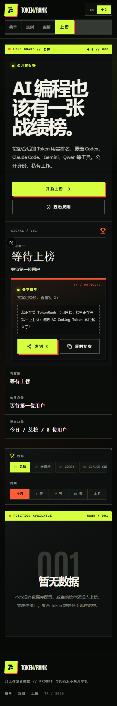
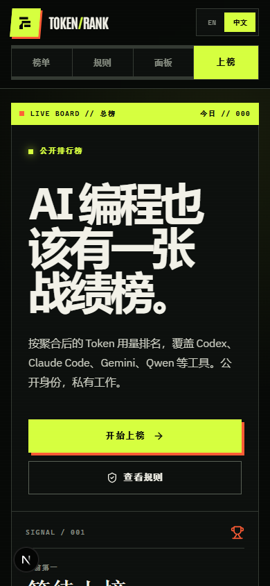
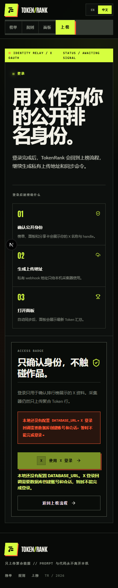
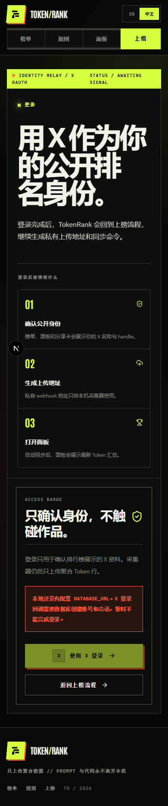
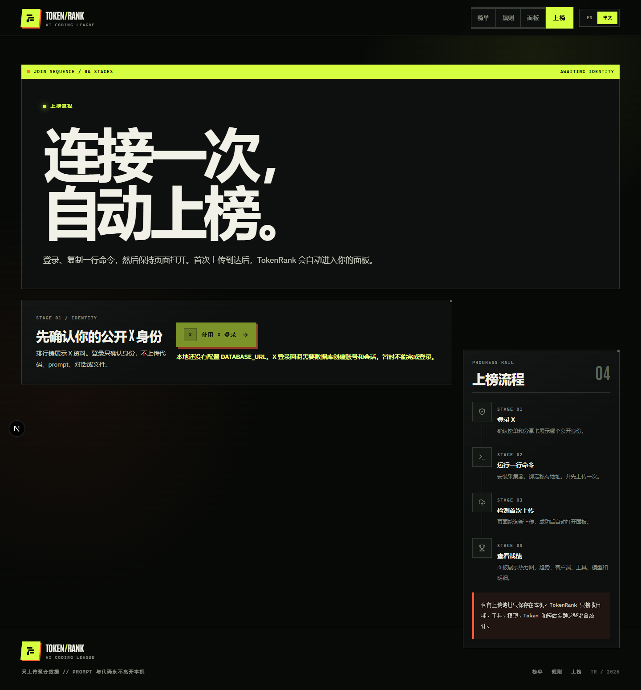
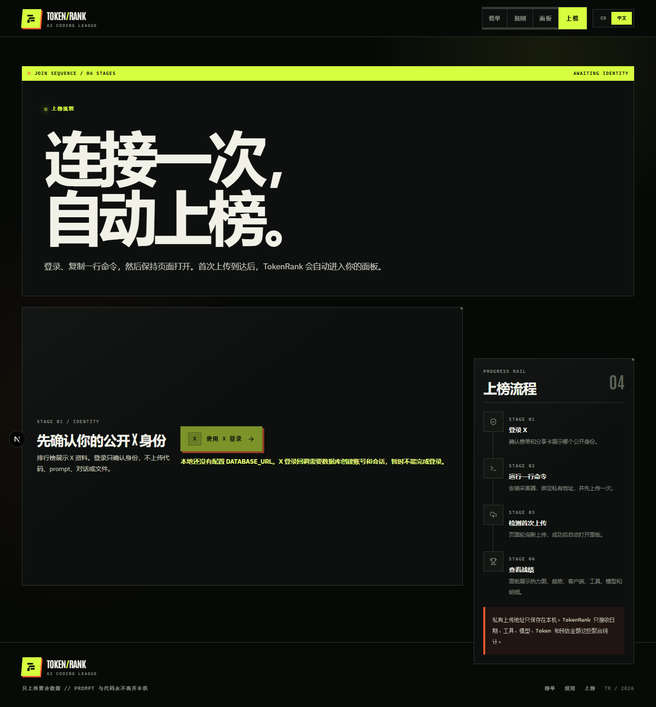
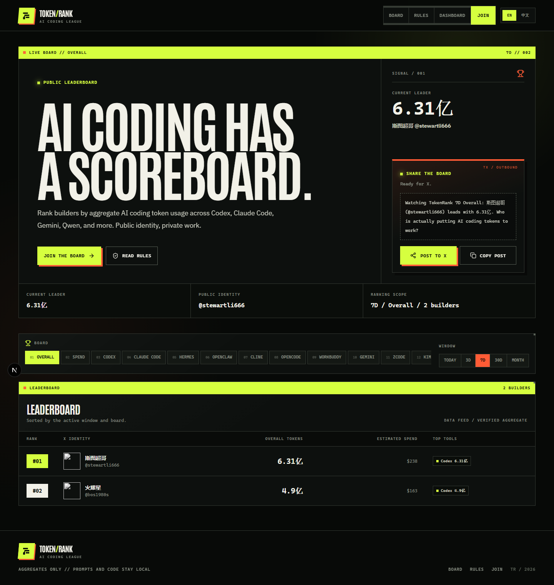
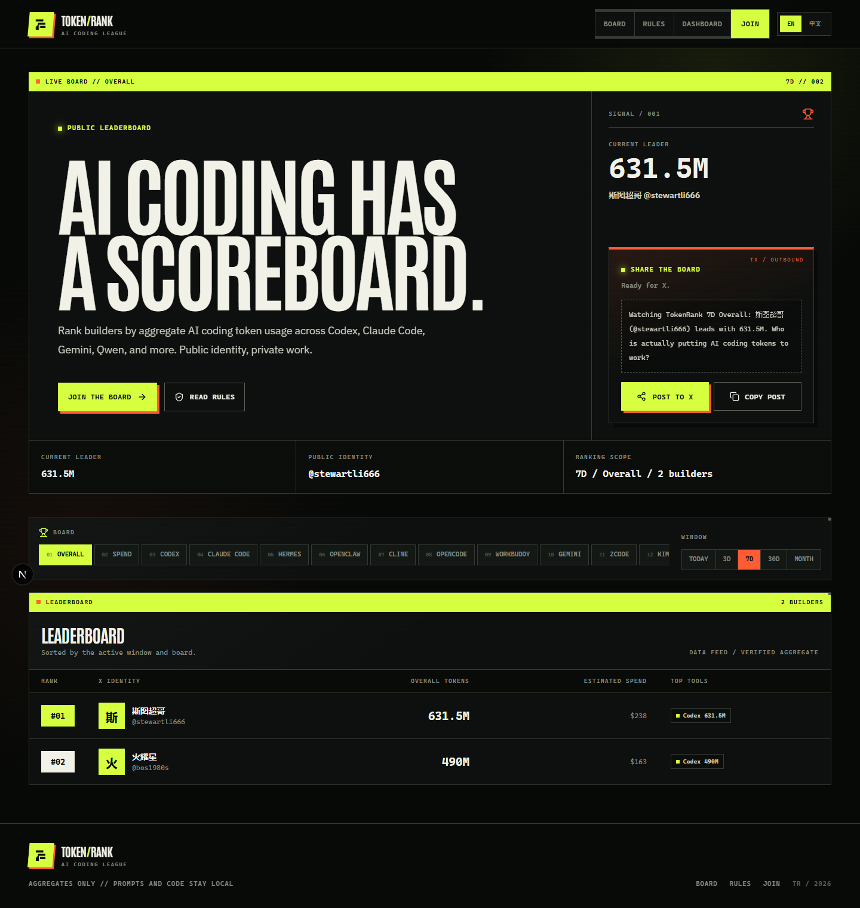
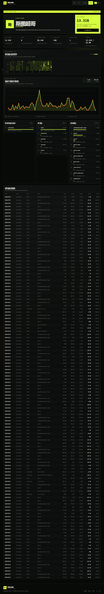
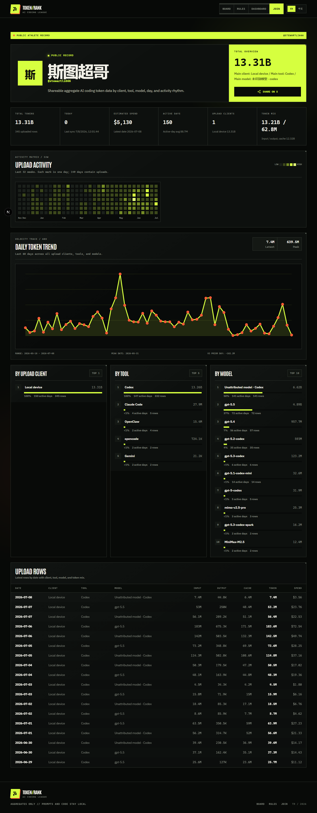

# TokenRank 全站重设计 QA 报告

| 字段 | 内容 |
|---|---|
| 日期 | 2026-07-11 |
| 地址 | http://127.0.0.1:3100 |
| 会话 | tokenrank-redesign |
| 范围 | 全部公开页面、未登录边界、桌面端与移动端；不执行真实 X OAuth |

## 汇总

| 严重度 | 数量 |
|---|---:|
| 严重 | 0 |
| 高 | 0 |
| 中 | 2 |
| 低 | 4 |
| 合计 | 6 |

## 问题

### ISSUE-001：移动导航没有填满可用宽度

| 字段 | 内容 |
|---|---|
| 严重度 | 低 |
| 分类 | 视觉 / 响应式 |
| 地址 | 全部页面，390px 视口 |
| 复现视频 | N/A |
| 状态 | 已修复 |

移动端第二行导航仅占据左侧，右侧出现大块无意义的灰色留白；预期四个入口在窄屏均匀分配宽度。

修复结果：四个移动入口已均匀填满导航轨道。

### ISSUE-002：登录页重复显示同一环境错误

| 字段 | 内容 |
|---|---|
| 严重度 | 低 |
| 分类 | UX / 内容 |
| 地址 | `/auth/signin?callbackUrl=/onboard` |
| 复现视频 | N/A |
| 状态 | 已修复 |

本地缺少数据库时，访问徽章内的错误框与登录按钮下方重复显示相同说明；预期保留一次清晰提示。

修复结果：错误现在只在访问徽章中显示一次。

### ISSUE-003：未登录上榜页桌面双栏高度失衡

| 字段 | 内容 |
|---|---|
| 严重度 | 低 |
| 分类 | 视觉 / 布局 |
| 地址 | `/onboard`，1440px 视口 |
| 复现视频 | N/A |
| 状态 | 已修复 |

左侧身份卡高度明显短于右侧流程轨，形成大片非意图性空区；预期桌面端两列形成稳定的视觉基线。

修复结果：桌面身份区已与流程轨形成一致高度和视觉基线。

### ISSUE-004：远程头像失败时显示破图图标

| 字段 | 内容 |
|---|---|
| 严重度 | 中 |
| 分类 | 视觉 / 稳健性 |
| 地址 | `/`，真实 7 天榜单 |
| 复现视频 | N/A |
| 状态 | 已修复 |

部分 X 头像地址不可用时，榜单身份列显示浏览器破图图标，影响榜单可信度；预期自动回退到用户首字母。

修复结果：头像先预加载，失败时稳定回退为品牌色首字母块。

### ISSUE-005：英文界面使用中文 Token 单位

| 字段 | 内容 |
|---|---|
| 严重度 | 中 |
| 分类 | 内容 / 国际化 |
| 地址 | `/`，真实 7 天榜单 |
| 复现视频 | N/A |
| 状态 | 已修复 |

默认英文界面的榜首、表格和分享文案显示 `万/亿`；预期英文使用 `K/M/B`，中文继续使用 `万/亿`。

修复结果：英文统一使用 `K/M/B`，中文保留 `万/亿`，分享文案也使用对应语言单位。

### ISSUE-006：公开记录明细让整页无限拉长

| 字段 | 内容 |
|---|---|
| 严重度 | 低 |
| 分类 | UX / 数据密度 |
| 地址 | `/u/stewartli666` |
| 复现视频 | N/A |
| 状态 | 已修复 |

120 条明细全部展开会让公开记录页增长到数千像素，页脚和其他页面信息很难到达；预期使用固定高度的数据窗和粘性表头。

修复结果：明细改为最高 52rem 的滚动数据窗，并增加粘性表头；公开页分享同时带上 profile URL。

## 验收结论

- 6 个发现项已全部修复，无未解决问题。
- 首页、规则、上榜、未登录面板、登录、公开个人页均完成 1440px 与 390px 浏览器验收。
- 所有移动页面 `documentElement.scrollWidth === innerWidth`。
- 真实 7 天榜单和真实公开个人数据已验证；浏览器错误缓冲为空。
